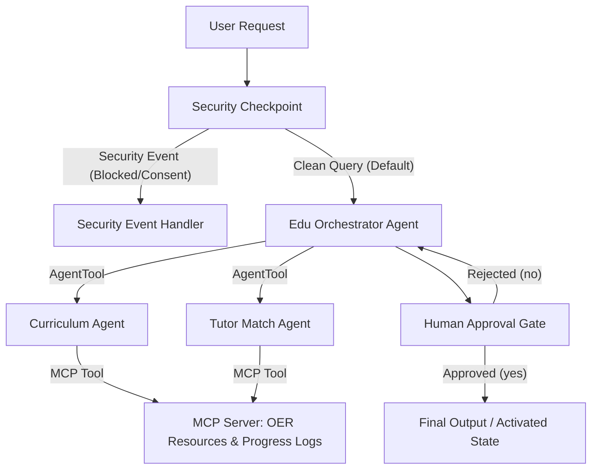
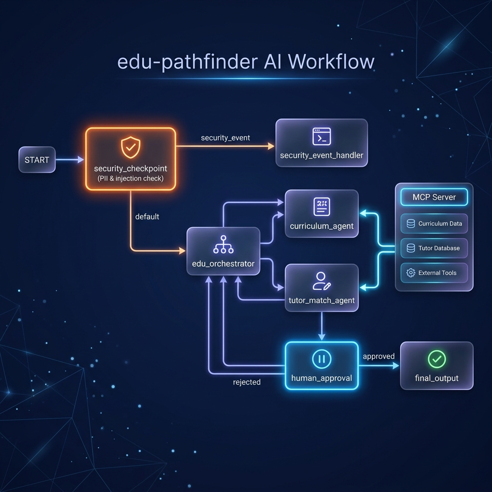

# Edu-Pathfinder

A secure, multi-agent educational assistant that creates personalized study plans, retrieves free learning resources, and matches students with free tutoring.

## Prerequisites

Ensure you have the following installed:
- **Python 3.11+** (see [python.org](https://www.python.org/))
- **uv**: Fast Python package manager (see [docs.astral.sh/uv](https://docs.astral.sh/uv/))
- **Gemini API Key**: Get a key from [Google AI Studio](https://aistudio.google.com/apikey)

## Quick Start

1. Clone this repository:
   ```bash
   git clone <repo-url>
   cd edu-pathfinder
   ```
2. Set up your environment file:
   ```bash
   cp .env.example .env
   # Open .env and add your GOOGLE_API_KEY
   ```
3. Install dependencies:
   ```bash
   make install
   ```
4. Run the interactive playground:
   ```bash
   make playground
   # Open http://localhost:18081 in your browser
   ```

## Architecture

The system uses the ADK 2.0 Workflow graph API, composed of custom logic nodes and a multi-agent sub-graph:



## How to Run

- **Interactive Playground**: 
  ```bash
  make playground
  ```
  Launches the ADK web interface at `http://localhost:18081` for interactive testing, chats, and debugging.
  
- **Production Web Server**:
  ```bash
  make run
  ```
  Starts a production-ready FastAPI app wrapper on port 8000 using Uvicorn.

## Sample Test Cases

### Test Case 1: Standard Math Curriculum & Tutoring Inquiry
- **Input**: `"I am in Grade 10 and struggling with quadratic equations. Can you design a study plan and find a tutor?"`
- **Expected Path**: `START` -> `security_checkpoint` (passes) -> `edu_orchestrator` -> delegates to `curriculum_agent` (finds OER resources via MCP) and `tutor_match_agent` (finds tutors via MCP) -> `human_approval` (prompts user to approve).
- **Check**: Look for the interactive prompt asking: `"Do you approve this study path? (yes/no)"`. Reply `"yes"` to activate the plan.

### Test Case 2: Underage Safety / Parental Consent Block
- **Input**: `"I am 10 years old and need help with my homework."`
- **Expected Path**: `START` -> `security_checkpoint` (detects age < 13 keywords) -> routes to `security_event_handler`.
- **Check**: The workflow halts immediately and returns a safety warning: `"Safety Notification: Parent or guardian consent is required..."`. No LLM calls are made to sub-agents.

### Test Case 3: PII Redaction Check
- **Input**: `"My name is John Doe, student ID SID-99321. Email me at john@example.com. I need study help for Biology."`
- **Expected Path**: `START` -> `security_checkpoint` (scrubs email and student ID) -> passes clean query to `edu_orchestrator` -> delegates to sub-agents.
- **Check**: View the console logs of the running playground. You will see:
  `{"pii_detected": true, "severity": "INFO", "action": "PASSED"}`
  The sub-agents only receive the scrubbed query: `"My name is John Doe, student ID [REDACTED_STUDENT_ID]. Email me at [REDACTED_EMAIL]. I need study help for Biology."`

## Troubleshooting

1. **Error `Uvicorn running on ... Address already in use`**
   - *Fix*: The port 18081 is occupied. Run `kill -9 $(lsof -t -i :18081)` to terminate the hanging process, then rerun `make playground`.
2. **Error `API_KEY_INVALID` or `404 Model Not Found`**
   - *Fix*: Verify `.env` contains your correct Gemini API Key and that `GEMINI_MODEL=gemini-2.5-flash` is used (avoid retired `gemini-1.5-*` models).
3. **No Agents Found error on startup**
   - *Fix*: Ensure you are running the `make playground` command from the `edu-pathfinder/` project directory, where the `app` directory resides.

## Assets

- **Architecture Diagram**:
  


