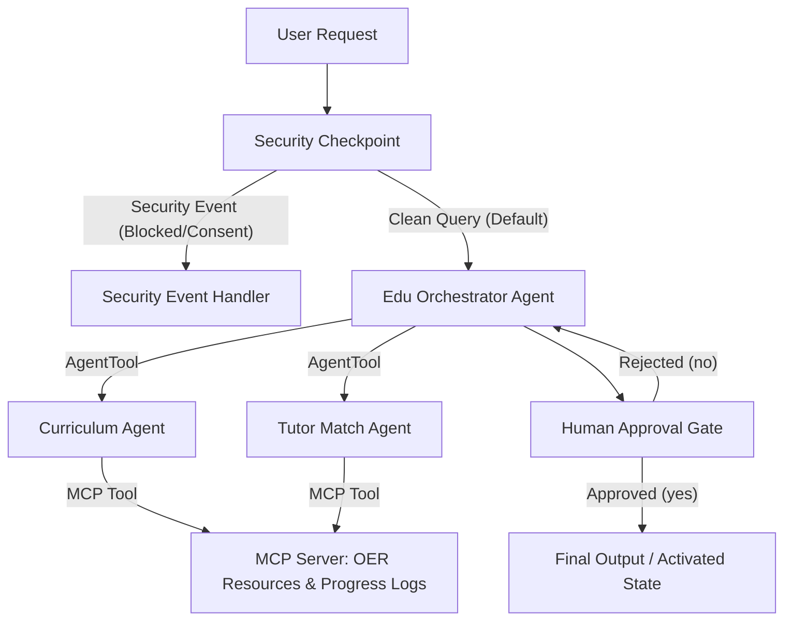

# Submission Writeup — Edu-Pathfinder

## Problem Statement
High-quality, personalized education remains inaccessible to many students due to cost, lack of tutoring resources, and difficulty in finding curriculum-aligned, free study materials. Additionally, deploying educational AI systems that handle student requests demands strict safety guidelines, child privacy compliance (PII protection), and robust defense against prompt injection attempts.

`edu-pathfinder` solves this by orchestrating specialized agents to dynamically build free study plans, match students with peer/volunteer tutors, and log progress, all wrapped within a strict security checkpoint and human-in-the-loop validation boundary.

## Solution Architecture

## Concepts Used

1. **ADK Workflow Graph API (ADK 2.0)**:
   - File: [agent.py](file:///Users/busha/Documents/google_x_kaggle/adk-workspace/edu-pathfinder/app/agent.py)
   - The graph models the application state flow sequentially and conditionally, handling transitions between security checks, agent orchestration, human reviews, and success triggers.
2. **LlmAgent**:
   - File: [agent.py](file:///Users/busha/Documents/google_x_kaggle/adk-workspace/edu-pathfinder/app/agent.py#L38-L86)
   - Three specialized `LlmAgent` instances handle distinct tasks (coordinator, curriculum generation, tutor lookup).
3. **AgentTool**:
   - File: [agent.py](file:///Users/busha/Documents/google_x_kaggle/adk-workspace/edu-pathfinder/app/agent.py#L85)
   - Allows the orchestrator to call sub-agents as tools while retaining top-level context and planning control.
4. **MCP Server**:
   - File: [mcp_server.py](file:///Users/busha/Documents/google_x_kaggle/adk-workspace/edu-pathfinder/app/mcp_server.py)
   - A model context protocol server built on Stdio transport exposing local tools to sub-agents.
5. **Security Checkpoint**:
   - File: [agent.py](file:///Users/busha/Documents/google_x_kaggle/adk-workspace/edu-pathfinder/app/agent.py#L97-L149)
   - Entry node verifying text length, stripping personal identifier signatures (PII), detecting prompt injections, and checking minimum user age thresholds.
6. **Agents CLI**:
   - Scaffolded structure, testing harness, and local hot-reloaded development via `agents-cli` standard tools.

## Security Design

- **PII Scrubbing**: Strips emails, standard phone numbers, and Student IDs (`SID-*`) using regular expressions before they reach LLM sub-agents. This complies with COPPA and general student privacy requirements.
- **Prompt Injection Defense**: Scans input for common instruction-override keywords. If matched, triggers a CRITICAL audit log severity and routes directly to the `security_event_handler`, avoiding LLM cost and risk.
- **Age Consent Validation**: Edu-Pathfinder triggers a WARNING severity audit log if keywords indicate a student under 13 is requesting access, requiring parental or school consent verification before proceeding.
- **Structured Audit Logging**: Outputs JSON log lines capturing safety status, session ID, timestamp, and action taken for full tracking capability.

## MCP Server Design

The server exposes three high-value tools via FastMCP:
1. `get_tutors_by_subject`: Looks up free tutoring databases and schedules peer study sessions.
2. `get_study_resources`: Retrieves curated open educational resources (OER) like OpenStax and Khan Academy modules.
3. `log_study_progress`: Interacts with progress databases to update units completed and study hours logged.

## Human-in-the-Loop (HITL) Flow

A `RequestInput` yield is configured in the `human_approval` node in [agent.py](file:///Users/busha/Documents/google_x_kaggle/adk-workspace/edu-pathfinder/app/agent.py#L159-L177). Before study plans and tutor matching recommendations are completed:
- The workflow pauses, generating an interactive prompt displaying the proposed plan.
- The student or teacher reviews the recommendations and inputs `yes` or `no`.
- If `yes`, the state transitions to `final_output` (approved). If `no`, it loops back to the orchestrator to adjust parameters based on user feedback.

## Demo Walkthrough

1. **Test Case 1 (Standard Flow)**: Inputting a Math study request leads to an intermediate plan. Responding `yes` to the HITL gate finalizes and logs the plan in state.
2. **Test Case 2 (Consent Flow)**: Saying "I am 10 years old" triggers the age warning checkpoint, preventing any downstream agent execution.
3. **Test Case 3 (PII Redaction)**: Entering personal emails or IDs results in immediate redaction in logs and agent context, preserving user confidentiality.

## Impact / Value Statement

`edu-pathfinder` bridges the educational divide by connecting under-resourced students with high-quality, zero-cost learning paths and mentors. It serves as a secure, scalable tool for educational non-profits, public libraries, and school systems to safely offer intelligent tutoring matching without exposing minors to privacy risks or abusing LLM token quotas.
